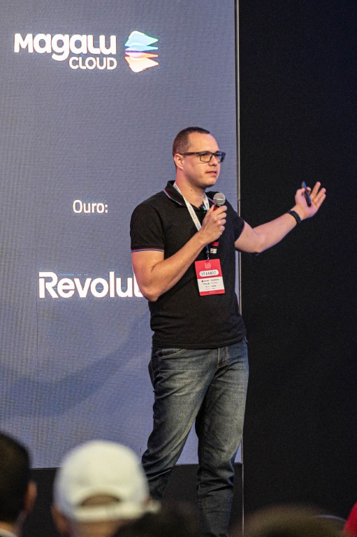

  

    <h1><strong>Bernardo Lankheet</strong>, DevOps</h1>
    

    <h4>About me</h4>
    
Born and raised in Espírito Santo, Brazil, I'm passionate about cycling, trail running, and road running – my way of disconnecting from technology!

    
As a Monitoring Expert and Senior DevOps Engineer, I transitioned from a traditional infrastructure analyst, making a pivotal shift to the DevOps world. I work on large-scale projects, orchestrating efficient deployments with Docker, Kubernetes, ArgoCD (automatic continuous delivery), GitHub/GitLab (version control and collaboration), and robust CI/CD pipelines. I also work on major monitoring projects, with a primary focus on Grafana, Zabbix, and Prometheus.

    
Obsessed with automating repetitive tasks and improving the team experience with tools that make life easier.

  

  

    
  

